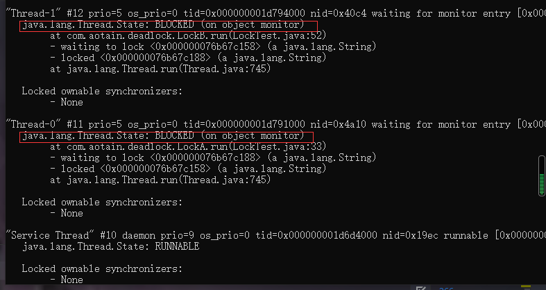

### jps 
### jstack

#### java中线程存在的几种状态
- NEW,未启动的。不会出现在Dump中
- RUNNABLE,在虚拟机内执行的
- BLOCKED,受阻塞并等待监视器锁
- WAITING,无限期等待另一个线程执行特定操作
- TIMED_WAITING,有时限的等待另一个线程的特定操作
- TERMINATED,已退出的

#### java线程状态对应的jstack信息

线程状态产生的原因
- runnable:状态一般为RUNNABLE。
- in Object.wait():等待区等待,状态为WAITING或TIMED_WAITING。
- waiting for monitor entry:进入区等待,状态为BLOCKED。
- waiting on condition:等待区等待、被park。
- sleeping:休眠的线程,调用了Thread.sleep()

#### 查看进程内是否有死锁
jstack -l pid |grep -20 "BLOCKED" // 查看处于blocked状态的线程

[参考1](https://www.cnblogs.com/myseries/p/12050083.html)
[参考2](https://www.iteye.com/blog/jameswxx-1041173)

[jvm监控](https://github.com/yuhangdai/yuhangdai.github.io/blob/master/_posts/2018-09-29-JVM%E5%9F%BA%E7%A1%80%E7%9F%A5%E8%AF%86.md)