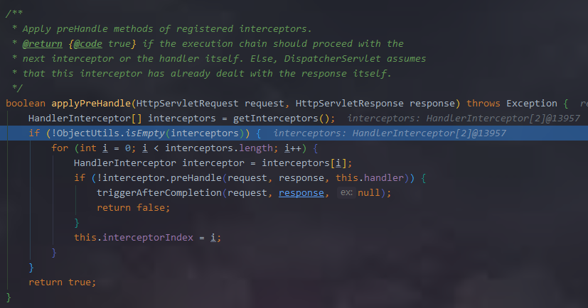

### 关键类
```java
DispatcherServlet  
- HandlerMapping
- HandlerAdapter
- ViewResolver
```   

#### 处理流程
处理从DispatcherServlet#doService开始

1.判断request是否为内部请求  //whether the given request is an include request    
- include request  
    ```java 
    // Keep a snapshot of the request attributes in case of an include,   
    // to be able to restore the original attributes after the include.
    Map<String, Object> attributesSnapshot = null;
    if (WebUtils.isIncludeRequest(request)) {
        attributesSnapshot = new HashMap<>();
        Enumeration<?> attrNames = request.getAttributeNames();
        while (attrNames.hasMoreElements()) {
            String attrName = (String) attrNames.nextElement();
            if (this.cleanupAfterInclude || attrName.startsWith(DEFAULT_STRATEGIES_PREFIX)) {
                attributesSnapshot.put(attrName, request.getAttribute(attrName));
            }
        }
    }
    ```
- 不是include request   

2.给request请求设置处理需要的组件参数    
   //Make framework objects available to handlers and view objects.  
     

3.核心流程DispatcherServlet#doDispatch 

- 根据request uri从handlerMappings中依次找，直到找到对应的handler及调用链
  
 
- 根据handler获取对应的handlerAdaptor  
//Determine handler adapter for the current request.
 
- 处理request请求的header，可能有些handler不支持
// Process last-modified header, if supported by the handler.
- 调用handler对应的HandlerInterceptor（前置处理器）
 
- 调用handler处理请求
// Actually invoke the handler.
 
- 调用handler对应的HandlerInterceptor（后置处理器）
- 调用DispatcherServlet#processDispatchResult处理结果（ContentNegotiatingViewResolver#resolveViewName）

