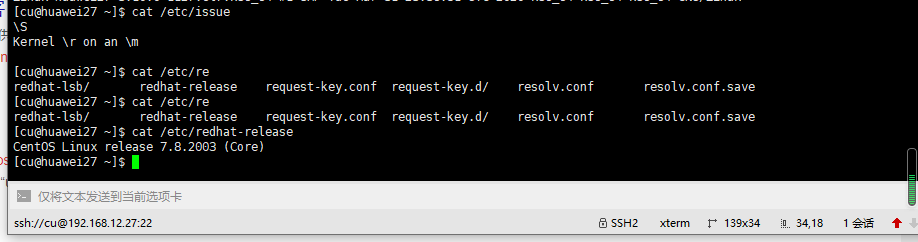

## ## linux系统安装sock5服务（CentOS7.8）




### 安装环境

- 操作系统：CentOS7.8

- Socks Server5：3.8.9-8


### 安装步骤

1.下载Socks Server5（3.8.9-8）[下载链接](https://sourceforge.net/projects/ss5/)

2.配置编译环境及依赖组件（确保网络畅通）

```linux
yum -y install pam-devel openldap-devel openssl-devel
```

3.将下载文件上传到指定目录，并在此目录下编译安装文件

```
tar -xzvf ss5-3.8.9-8.tar.gz
cd ss5-3.8.9
./configure 
make && make install
```

4.备份配置文件

```
cp -R /etc/opt/ss5{,.bak}
```

5.开启密码访问

```
cat << "EOF" >> /etc/opt/ss5/ss5.conf
auth    0.0.0.0/0 - u
permit u 0.0.0.0/0    - 0.0.0.0/0     -       - - - -
EOF
```

6.设置密码

```
echo 'admin admin' >> /etc/opt/ss5/ss5.passwd
```

7.配置监听端口

```
echo 'SS5_OPTS=" -u root -b 0.0.0.0:6655"' >> /etc/sysconfig/ss5
```

8.启动ss5

```
chmod +x /etc/init.d/ss5
service ss5 start
```

9.设置开机自启动

```
echo 'mkdir /var/run/ss5/' >> /etc/rc.d/rc.local 
chmod +x /etc/rc.d/rc.local 
chkconfig ss5 on
```

10.验证是否启动成功


[socks5安装文件下载](https://sourceforge.net/projects/ss5/)

[socks5代理服务器搭建](https://iblogs.top/2019/05/21/socks5%E4%BB%A3%E7%90%86%E6%9C%8D%E5%8A%A1%E5%99%A8%E6%90%AD%E5%BB%BA/)

[socks5配置项](http://ss5.sourceforge.net/configuration.htm)

[problems with auth on ss5](https://sourceforge.net/p/ss5/support-requests/89/)


### java http请求使用ss5代理

[http](https://www.cnblogs.com/langtianya/p/4283566.html)

[httpclient](https://zhuanlan.zhihu.com/p/33726379)


### java socket套接字使用ss5代理

确保socket套接字可正常连接(ip:port)，telnet可以连上(**确保防火墙端口开放**)。

[socket套接字](https://blog.csdn.net/wsjzzcbq/article/details/86541549)


### push模块通过socket代理访问外网发送邮件

1. tomcat启动脚本中增加代理配置信息

   `-DsocksProxyHost=192.168.12.28 -DsocksProxyPort=6655`

   ```
   windows
   在catalina.bat中增加(注意ip端口与ss5保持一致)
   set "JAVA_OPTS=%JAVA_OPTS% -DsocksProxyHost=192.168.12.28 -DsocksProxyPort=6655"
   linux
   在catalina.sh中增加
   set "JAVA_OPTS=%JAVA_OPTS% -DsocksProxyHost=192.168.12.28 -DsocksProxyPort=6655"
   ```

   

2. 修改`config.properties`中

   ```
   # socket代理用户名和密码
   (与ss5配置文件中用户密码一致)
   socket.proxy.user=admin 
   socket.proxy.password=admin
   ```

3. 确保ss5代理正常运行（可通过qq测试或者telnet）

4. 查看ss5日志文件（/var/log/ss5/ss5.log）且push项目不报错

   ```
   [25/Nov/2020:13:56:48 CST] [1079469824] 192.168.3.110 admin "CONNECT" STARTED 0 0 0 (192.168.3.110:50615 -> 219.134.132.214:25)
   [25/Nov/2020:13:56:49 CST] [1079469824] 192.168.3.110 admin "CONNECT" TERMINATED 309 4364 1 (192.168.3.110:50615 -> 219.134.132.214:25)
   
   ```

5. 关掉ss5代理再次进行测试

   邮件无法正常发送且web程序报错

   ```
   org.springframework.mail.MailSendException: Mail server connection failed; nested exception is javax.mail.MessagingException: Could not connect to SMTP host: 219.134.132.214, port: 25 (java.net.SocketException: Can't connect to SOCKS proxy:Connection refused: connect). Failed messages: javax.mail.MessagingException: Could not connect to SMTP host: 219.134.132.214, port: 25 (java.net.SocketException: Can't connect to SOCKS proxy:Connection refused: connect); message exception details (1) are:
   Failed message 1:
   javax.mail.MessagingException: Could not connect to SMTP host: 219.134.132.214, port: 25 (java.net.SocketException: Can't connect to SOCKS proxy:Connection refused: connect)
   	at com.sun.mail.smtp.SMTPTransport.openServer(SMTPTransport.java:1934)
   	at com.sun.mail.smtp.SMTPTransport.protocolConnect(SMTPTransport.java:638)
   	at javax.mail.Service.connect(Service.java:251)
   	at org.springframework.mail.javamail.JavaMailSenderImpl.connectTransport(JavaMailSenderImpl.java:486)
   	at org.springframework.mail.javamail.JavaMailSenderImpl.doSend(JavaMailSenderImpl.java:406)
   	at org.springframework.mail.javamail.JavaMailSenderImpl.send(JavaMailSenderImpl.java:345)
   	at org.springframework.mail.javamail.JavaMailSenderImpl.send(JavaMailSenderImpl.java:340)
   	at com.aotain.push.email.SendAttachEmailService.sendWithAttach(SendAttachEmailService.java:130)
   	at com.aotain.push.email.SendAttachEmailService.sendHtmlEmail(SendAttachEmailService.java:50)
   	at com.aotain.push.service.upgrade.proxy.EmailMessageServiceWithAttachProxy.innerSendMessage(EmailMessageServiceWithAttachProxy.java:100)
   	at com.aotain.push.service.upgrade.proxy.BaseMsgServiceProxy.sendMessageNew(BaseMsgServiceProxy.java:37)
   	at com.aotain.push.thread.SendMessageThreadWithAttach.run(SendMessageThreadWithAttach.java:32)
   	at java.util.concurrent.ThreadPoolExecutor.runWorker(ThreadPoolExecutor.java:1142)
   	at java.util.concurrent.ThreadPoolExecutor$Worker.run(ThreadPoolExecutor.java:617)
   	at java.lang.Thread.run(Thread.java:745)
   Caused by: java.net.SocketException: Can't connect to SOCKS proxy:Connection refused: connect
   	at java.net.SocksSocketImpl.connect(SocksSocketImpl.java:428)
   	at java.net.Socket.connect(Socket.java:589)
   	at java.net.Socket.connect(Socket.java:538)
   	at com.sun.mail.util.SocketFetcher.createSocket(SocketFetcher.java:288)
   	at com.sun.mail.util.SocketFetcher.getSocket(SocketFetcher.java:231)
   	at com.sun.mail.smtp.SMTPTransport.openServer(SMTPTransport.java:1900)
   	... 14 more
   ```

   

