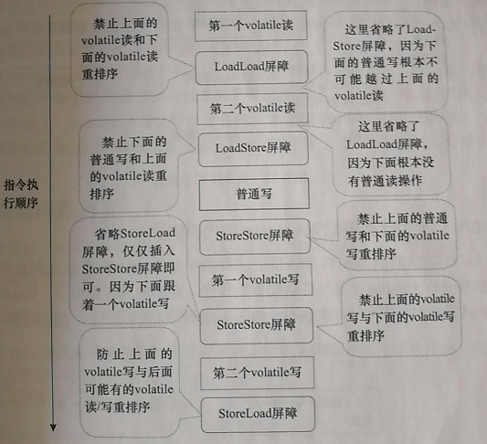

### volatile（可见性、指令重排）
[一文解决内存屏障](https://monkeysayhi.github.io/2017/12/28/%E4%B8%80%E6%96%87%E8%A7%A3%E5%86%B3%E5%86%85%E5%AD%98%E5%B1%8F%E9%9A%9C/)

**可见性**
- 当对volatile变量执行写操作后，JMM会把工作内存中的最新变量值强制刷新到主内存
- 写操作会导致其他线程中的缓存无效

指令重排
编译器和处理器都会对代码编译后的指令进行重排序

volatile通过编译器在生成字节码时，在指令序列中添加‘**内存屏障**’实现禁止指令重排序的。

**内存屏障**  
Memory barriers provide two properties.  
Firstly, they preserve externally visible program order 
by ensuring all instructions either side of the barrier appear in the correct program order 
if observed from another CPU and, 
首先，它们通过确保屏障任一侧的所有指令（如果从另一个cpu观察）都已正确的顺序出现，并保留程序顺序外部可见性
secondly, they make the memory visible by ensuring the data is propagated to the cache sub-system.
其次，它通过将数据扩散到缓存子系统确保内存可见性

硬件层面的“内存屏障”：    
- sfence：即写屏障(Store Barrier)，在写指令之后插入写屏障，能让写入缓存的最新数据写回到主内存，以保证写入的数据立刻对其他线程可见
- lfence：即读屏障(Load Barrier)，在读指令前插入读屏障，可以让高速缓存中的数据失效，重新从主内存加载数据，以保证读取的是最新的数据。
- mfence：即全能屏障(modify/mix Barrier )，兼具sfence和lfence的功能
- lock 前缀：lock不是内存屏障，而是一种锁。执行时会锁住内存子系统来确保执行顺序，甚至跨多个CPU。
JMM层面的“内存屏障”    
- LoadLoad屏障： 对于这样的语句Load1; LoadLoad; Load2，在Load2及后续读取操作要读取的数据被访问前，保证Load1要读取的数据被读取完毕。
- StoreStore屏障：对于这样的语句Store1; StoreStore; Store2，在Store2及后续写入操作执行前，保证Store1的写入操作对其它处理器可见。
- LoadStore屏障：对于这样的语句Load1; LoadStore; Store2，在Store2及后续写入操作被刷出前，保证Load1要读取的数据被读取完毕。
- StoreLoad屏障： 对于这样的语句Store1; StoreLoad; Load2，在Load2及后续所有读取操作执行前，保证Store1的写入对所有处理器可见。

[cpu内存屏障](https://mechanical-sympathy.blogspot.com/2011/07/memory-barriersfences.html)
[volatile底层原理](https://zhuanlan.zhihu.com/p/133851347)

### synchronized和lock区别
synchronized基于jvm实现锁机制，lock基于java代码实现锁机制；
synchronized只能实现非公平锁，lock既可实现公平锁，也可实现非公平锁；

### synchronized（原子性）

    同步代码块
    同步静态方法
    同步实例方法

无论是对一个对象进行加锁还是对一个方法进行加锁，实际上，都是对对象进行加锁    

锁对象：锁实际上是加在对象上的，那么被加了锁的对象我们称之为锁对象，在java中，任何一个对象都能成为锁对象。   
    
**偏向锁、轻量级锁（自旋锁、自适应自旋锁）、重量级锁**

#### 偏向锁
偏向锁定义：
偏向锁是jdk1.6引入的一项锁优化，其中的“偏”是偏心的偏。它的意思就是说，这个锁会偏向于第一个获得它的线程，在接下来的执行过程中，
假如该锁没有被其他线程所获取，没有其他线程来竞争该锁，那么持有偏向锁的线程将永远不需要进行同步操作

偏向锁的标志位是“01”，状态是“0”，表示该对象还没有被加上偏向锁。（“1”是表示被加上偏向锁）

对象创建成功就会存在偏向锁标志位，表示所有对象均可偏向。
但此时标志位值为0，表示偏向锁没生效。

**当线程执行到临界区（critical section）时，此时会利用CAS(Compare and Swap)操作，将线程ID插入到``Markword``中，同时修改偏向锁的标志位**

Load-and-test，也就是简单判断一下当前线程id是否与``Markword``当中的线程id是否一致.
如果一致，则说明此线程已经成功获得了锁，继续执行下面的代码.
如果不一致，则要检查一下对象是否还是可偏向，即“是否偏向锁”标志位的值。
如果还未偏向，则利用CAS操作来竞争锁，也即是第一次获取锁时的操作。
如果此对象已经偏向了，并且不是偏向自己，则说明存在了竞争。此时可能就要根据另外线程的情况，可能是重新偏向，也有可能是做偏向撤销，但大部分情况下就是升级成轻量级锁了

#### 轻量级锁（轻量级锁适用于那些同步代码块执行的很快的场景）
- 自旋锁  
所谓自旋，就是指当有另外一个线程来竞争锁时，这个线程会在原地循环等待，而不是把该线程给阻塞，直到那个获得锁的线程释放锁之后，这个线程就可以马上获得锁的
**存在问题**
1.如果同步代码块执行很慢，导致其它线程不停执行循环等待，浪费cpu执行时间；
2.如果同时自旋等待的线程过多，可能导致某些线程长时间或者一直获取不到锁

基于这个问题，我们必须给线程空循环设置一个次数，当线程超过了这个次数，
我们就认为，继续使用自旋锁就不适合了，此时锁会再次膨胀，升级为重量级锁。
默认情况下，自旋的次数为10次，用户可以通过-XX:PreBlockSpin来进行更改。

- 自适应自旋锁    
所谓自适应自旋锁就是线程空循环等待的自旋次数并非是固定的，而是会动态着根据实际情况来改变自旋等待的次数（**根据线程最近获取锁状态动态确定自旋次数**）。
假如一个线程1刚刚成功获得一个锁，当它把锁释放了之后，线程2获得该锁，并且线程2在运行的过程中，此时线程1又想来获得该锁了，但线程2还没有释放该锁，所以线程1只能自旋等待，但是虚拟机认为，由于线程1刚刚获得过该锁，那么虚拟机觉得线程1这次自旋也是很有可能能够再次成功获得该锁的，所以会延长线程1自旋的次数。

另外，如果对于某一个锁，一个线程自旋之后，很少成功获得该锁，那么以后这个线程要获取该锁时，是有可能直接忽略掉自旋过程，直接升级为重量级锁的，以免空循环等待浪费资源。

**轻量级锁也被称为非阻塞同步、乐观锁，因为这个过程并没有把线程阻塞挂起，而是让线程空循环等待，串行执行**

#### 重量级锁

轻量级锁膨胀之后，就升级为重量级锁了。重量级锁是依赖对象内部的monitor锁来实现的，
而monitor又依赖操作系统的MutexLock(互斥锁)来实现的，所以重量级锁也被成为互斥锁

为什么说重量级锁开销大呢？
**主要是，当系统检查到锁是重量级锁之后，会把等待想要获得锁的线程进行阻塞，被阻塞的线程不会消耗cup。但是阻塞或者唤醒一个线程时，都需要操作系统来帮忙，这就需要从用户态转换到内核态，
而转换状态是需要消耗很多时间的，有可能比用户执行代码的时间还要长**

[锁进化过程](https://mp.weixin.qq.com/s/qDvd8MYAzBXOsWgzwIbNMA)

### AQS原理

acquire方法原理

    /**
     * Acquires in exclusive mode, ignoring interrupts.  Implemented
     * by invoking at least once {@link #tryAcquire},
     * returning on success.  Otherwise the thread is queued, possibly
     * repeatedly blocking and unblocking, invoking {@link
     * #tryAcquire} until success.  This method can be used
     * to implement method {@link Lock#lock}.
     *
     * @param arg the acquire argument.  This value is conveyed to
     *        {@link #tryAcquire} but is otherwise uninterpreted and
     *        can represent anything you like.
     */
    public final void acquire(int arg) {
        // 调用子类（Sync、FailSync、NonfailSync）重写的tryAcquire方法获取资源
        // 1.成功 acquire结束    
        // 2.失败 调用AbstractQueuedSynchronizer#acquireQueued 
        // acquireQueued 获取当前节点前一个节点，判断当前节点是否为第二个节点
        // 只有第二个节点会尝试获取锁资源，成功返回,失败park
        // 其它节点直接park
        if (!tryAcquire(arg) &&
            acquireQueued(addWaiter(Node.EXCLUSIVE), arg))
            selfInterrupt();
    }

``FailSync#tryAcquire``方法代码
 
    /**
     * Fair version of tryAcquire.  Don't grant access unless
     * recursive call or no waiters or is first.
     */
    protected final boolean tryAcquire(int acquires) {
        final Thread current = Thread.currentThread();
        int c = getState();
        // 资源空闲
        if (c == 0) {
            // 1.hasQueuedPredecessors()判断
            // 2. cas设置state
            // 3. 设置资源当前占用线程
            if (!hasQueuedPredecessors() &&
                compareAndSetState(0, acquires)) {
                setExclusiveOwnerThread(current);
                return true;
            }
        }
        // 资源已被占用；判断是否是此线程占用
        else if (current == getExclusiveOwnerThread()) {
            int nextc = c + acquires;
            if (nextc < 0)
                throw new Error("Maximum lock count exceeded");
            setState(nextc);
            return true;
        }
        return false;
    }
    
``NonfailSync#tryAcquire``

``AbstractQueuedSynchronizer#addWaiter``将node加入到队列中

    /**
     * Creates and enqueues node for current thread and given mode.
     *
     * @param mode Node.EXCLUSIVE for exclusive, Node.SHARED for shared
     * @return the new node
     */
    private Node addWaiter(Node mode) {
        Node node = new Node(Thread.currentThread(), mode);
        // Try the fast path of enq; backup to full enq on failure
        Node pred = tail;
        if (pred != null) {
            node.prev = pred;
            if (compareAndSetTail(pred, node)) {
                pred.next = node;
                return node;
            }
        }
        enq(node);
        return node;
    }
    
    /**
     * Inserts node into queue, initializing if necessary. See picture above.
     * @param node the node to insert
     * @return node's predecessor
     */
    private Node enq(final Node node) {
        for (;;) {
            Node t = tail;
            if (t == null) { // Must initialize
                if (compareAndSetHead(new Node()))
                    tail = head;
            } else {
                node.prev = t;
                if (compareAndSetTail(t, node)) {
                    t.next = node;
                    return t;
                }
            }
        }
    }

``AbstractQueuedSynchronizer#acquireQueued ``方法代码  
  
    /**
     * Acquires in exclusive uninterruptible mode for thread already in
     * queue. Used by condition wait methods as well as acquire.
     *
     * @param node the node
     * @param arg the acquire argument
     * @return {@code true} if interrupted while waiting
     */
    final boolean acquireQueued(final Node node, int arg) {
        boolean failed = true;
        try {
            boolean interrupted = false;
            for (;;) {
                final Node p = node.predecessor();
                if (p == head && tryAcquire(arg)) {
                    setHead(node);
                    p.next = null; // help GC
                    failed = false;
                    return interrupted;
                }
                if (shouldParkAfterFailedAcquire(p, node) &&
                    parkAndCheckInterrupt())
                    interrupted = true;
            }
        } finally {
            if (failed)
                cancelAcquire(node);
        }
    }
    
### ReentrantLock
通过AQS实现lock unlock逻辑
公平锁 FairSync
非公平锁 NonfailSync

ReentrantLock#lock 实际通过FairSync#lock或者NonfailSync#lock实现  

FairSync#lock代码
    
    final void lock() {
        acquire(1);
    }
    
    /**
     * Fair version of tryAcquire.  Don't grant access unless
     * recursive call or no waiters or is first.
     */
    protected final boolean tryAcquire(int acquires) {
        final Thread current = Thread.currentThread();
        int c = getState();
        if (c == 0) {
            // 判断等待队列中是否有线程存在
            if (!hasQueuedPredecessors() &&
                compareAndSetState(0, acquires)) {
                setExclusiveOwnerThread(current);
                return true;
            }
        }
        else if (current == getExclusiveOwnerThread()) {
            int nextc = c + acquires;
            if (nextc < 0)
                throw new Error("Maximum lock count exceeded");
            setState(nextc);
            return true;
        }
        return false;
    }
    
NonfailSync#lock
    
    /**
     * Performs lock.  Try immediate barge, backing up to normal
     * acquire on failure.
     */
    final void lock() {
        if (compareAndSetState(0, 1))
            setExclusiveOwnerThread(Thread.currentThread());
        else
            acquire(1);
    }
    
    /**
     * Performs non-fair tryLock.  tryAcquire is implemented in
     * subclasses, but both need nonfair try for trylock method.
     */
    final boolean nonfairTryAcquire(int acquires) {
        final Thread current = Thread.currentThread();
        int c = getState();
        if (c == 0) {
            if (compareAndSetState(0, acquires)) {
                setExclusiveOwnerThread(current);
                return true;
            }
        }
        else if (current == getExclusiveOwnerThread()) {
            int nextc = c + acquires;
            if (nextc < 0) // overflow
                throw new Error("Maximum lock count exceeded");
            setState(nextc);
            return true;
        }
        return false;
    }

总结：**公平锁和非公平锁只有两处不同**

非公平锁在调用 lock 后，首先就会调用 CAS 进行一次抢锁，如果这个时候恰巧锁没有被占用，那么直接就获取到锁返回了。
非公平锁在 CAS 失败后，和公平锁一样都会进入到 tryAcquire 方法，在 tryAcquire 方法中，如果发现锁这个时候被释放了（state == 0），非公平锁会直接 CAS 抢锁，但是公平锁会判断等待队列是否有线程处于等待状态，如果有则不去抢锁，乖乖排到后面。
公平锁和非公平锁就这两点区别，如果这两次 CAS 都不成功，那么后面非公平锁和公平锁是一样的，都要进入到阻塞队列等待唤醒

### semaphore countDownLatch cyclicBarrier

**synchronized 和 ReentrantLock 都是一次只允许一个线程访问某个资源，Semaphore(信号量)可以指定多个线程同时访问某个资源**

sync和lock都是防止多个线程同时访问某个临界资源，但是在实际使用过程中，
存在某资源能同时被多个线程访问，但是同时访问的线程数量需要进行限制，
这种情况下可以通过semaphore信号量实现
 **Semaphore 经常用于限制获取某种资源的线程数量**

CountDownLatch可以实现等待n个资源执行完开始某一任务，或者n个线程等待统一资源后一起执行。
场景一：任务n要在任务1...n-1完成后执行；比如开会时等待其它人员完成手头任务后开始
场景二：n-1个任务等待同一任务完成后一起开始执行；比如8个短跑运动员等待裁判开枪后同时开跑

cyclicBarrier也可实现CountDownLatch效果，与之不同的是CountDownLatch计数是不可重置的，
cyclicBarrier可重置计数即可以复用同一cyclicBarrier再次实现同样场景任务。

#### CountDownLatch和CyclicBarrier区别

CountDownLatch: A synchronization aid that allows one or more threads to wait until a set of operations being performed in other threads completes.
(CountDownLatch: 一个或者多个线程，**等待其他多个线程**完成某件事情之后才能执行；) 
CyclicBarrier : A synchronization aid that allows a set of threads to all wait for each other to reach a common barrier point.
(CyclicBarrier : 多个线程**互相等待**，直到到达同一个同步点，再继续一起执行。)

### ThreadLocal    
用于保存线程内共享变量，可以在同一线程中随时使用此变量

#### ThreadLocal内存泄露问题

[ThreadLocal内存泄漏问题](https://juejin.im/post/6844903683751149582)

ThreadLocal通过线程中变量threadLocalMap保存，其结构为hash类型
key为ThreadLocal<T>的弱引用,**弱引用**的特点是，如果这个对象只存在弱引用，那么在下一次垃圾回收的时候必然会被清理掉
所以如果 ThreadLocal 没有被外部强引用的情况下，在垃圾回收的时候会被清理掉的，这样一来 ThreadLocalMap 中使用这个 ThreadLocal 的 key 也会被清理掉。
但是，value 是强引用，不会被清理，这样一来就会出现 key 为 null 的 value

#### ThreadLocal导致PagerHelper查询结果异常问题
[解决办法](https://blog.csdn.net/w8y56f/article/details/100710380)

java引用类型
- 强引用
- 软引用
- 弱引用
- 虚引用

